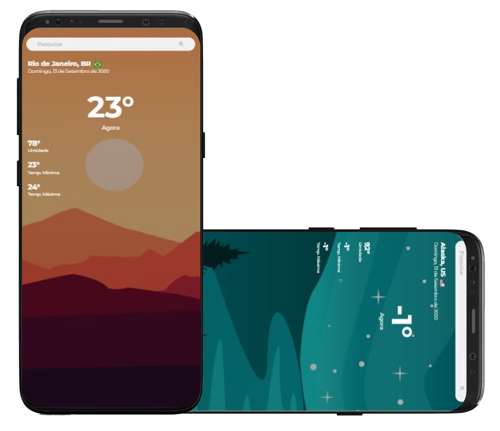
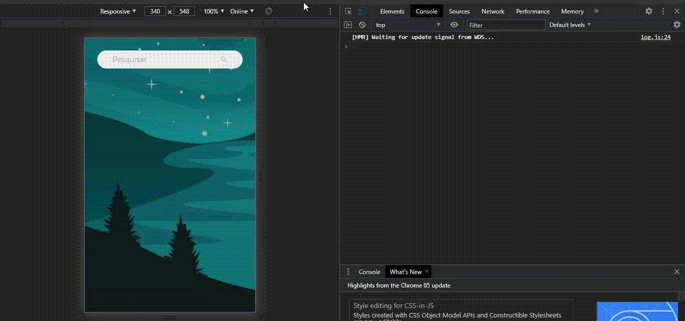

<h2 align="center">
  The Weather App by @rodrigoge ☀️🌧️
</h2>

<p align="center"> 
  A simple weather app in your city. 
</p>

<p align="center">
  <a href="#eyes-languages">Languages</a>&nbsp;&nbsp;&nbsp;|&nbsp;&nbsp;&nbsp;
  <a href="#dart-objective">Objective</a>&nbsp;&nbsp;&nbsp;|&nbsp;&nbsp;&nbsp;
  <a href="#pushpin-challenge">Challenge</a>&nbsp;&nbsp;&nbsp;|&nbsp;&nbsp;&nbsp;
  <a href="#rocket-technology">Technology</a>&nbsp;&nbsp;&nbsp;|&nbsp;&nbsp;&nbsp;
  <a href="#clipboard-how-to-use">How to use</a>&nbsp;&nbsp;&nbsp;|&nbsp;&nbsp;&nbsp;
  <a href="#memo-licença">Licence</a>
</p>

<p align="center">
  
</p>

## :eyes: Languages
- :brazil: [Portuguese-BR](https://github.com/rodrigoge/weather-app/blob/master/README.md)
- :united_nations: [English](https://github.com/rodrigoge/weather-app/blob/master/README-ENG.md)

## :dart: Objective
Develop the front-end of an application with a primary focus on allowing the user to find the climate of a specific city according to their search.

## :pushpin: Challenge
Use a climate API in order to understand the concepts of use with React and how to obtain this data. In this app I used the [Open Weather API](https://openweathermap.org/api), which is perfect for the purpose, it brings all the content in JSON format, which facilitates integration with the front-end.

<p align="center">
  
</p>

## :rocket: Technology
Some of the main technologies and / or packages used for the development of the project.

- [ReactJS](https://reactjs.org/)
- [Open Weather](https://openweathermap.org/api)
- [React Country Flag](https://www.npmjs.com/package/react-country-flag)
- And some other packages..

## :clipboard: How to use
To clone and run this application, you will need [Git](https://git-scm.com/), [Node.js v10.16](https://nodejs.org/en/) or higher + [Yarn v1.13](https://yarnpkg.com/) or higher installed on your computer.

```bash
# Clone the repo
$ git clone https://github.com/rodrigoge/weather-app

# Go to the repo
$ cd weather-app

# Install dependencies
$ cd weather-app
$ yarn install ou npm install

# Run the project
$ cd weather-app
$ npm start
```

## :memo: Licença
This project was developed using the license from MIT. See more about [LICENÇA](https://github.com/rodrigoge/weather-app/blob/master/LICENSE) to more infos.

---

Made with :heart: by [Rodrigo Gouveia.](https://www.linkedin.com/in/rgestevao/) :v:
