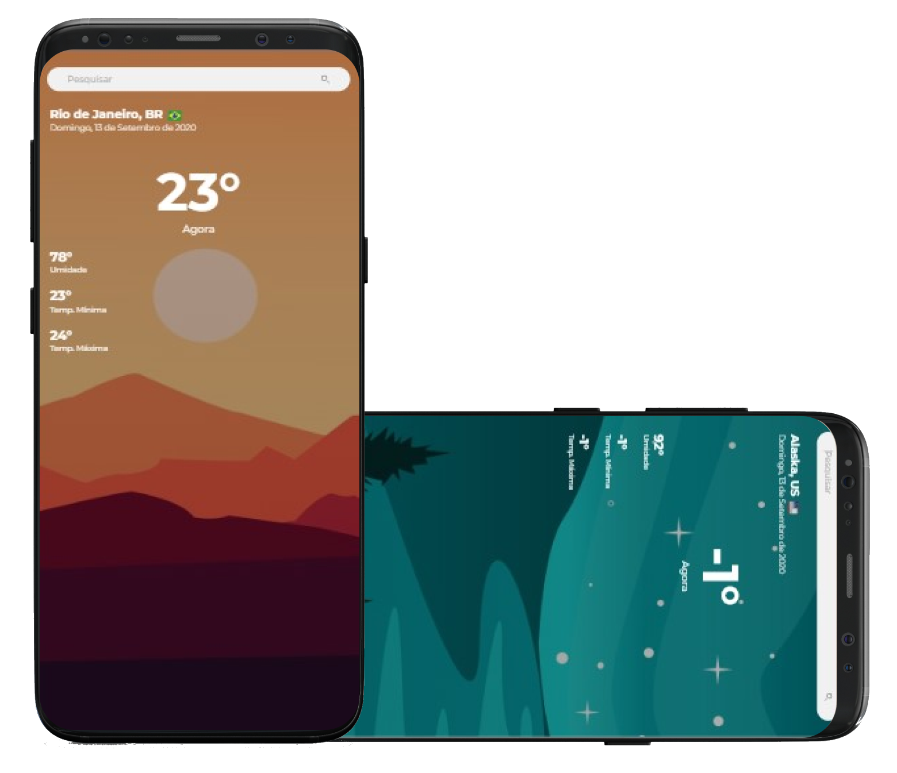
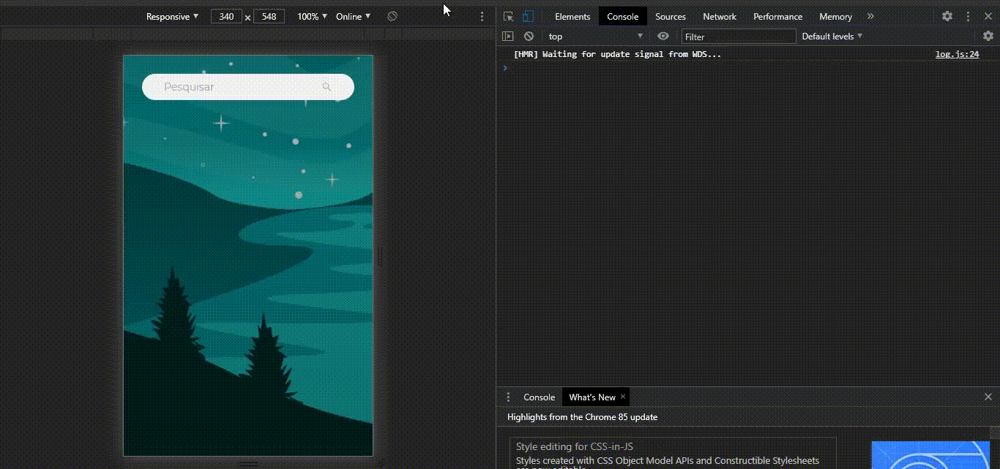

<h2 align="center">
  The Weather App by @rodrigoge ☀️🌧️
</h2>

<p align="center"> 
  A simple weather app in your city. 
</p>

<p align="center">
  <a href="#eyes-idiomas">Idiomas</a>&nbsp;&nbsp;&nbsp;|&nbsp;&nbsp;&nbsp;
  <a href="#dart-objetivo">Objetivo</a>&nbsp;&nbsp;&nbsp;|&nbsp;&nbsp;&nbsp;
  <a href="#pushpin-desafio">Desafio</a>&nbsp;&nbsp;&nbsp;|&nbsp;&nbsp;&nbsp;
  <a href="#rocket-tecnologias">Tecnologias</a>&nbsp;&nbsp;&nbsp;|&nbsp;&nbsp;&nbsp;
  <a href="#clipboard-como-usar">Como usar</a>&nbsp;&nbsp;&nbsp;|&nbsp;&nbsp;&nbsp;
  <a href="#memo-licença">Licença</a>
</p>

<p align="center">
  
</p>


## :eyes: Idiomas
- :brazil: [Português-BR](https://github.com/rodrigoge/weather-app/blob/master/README.md)
- :united_nations: [English](https://github.com/rodrigoge/weather-app/blob/master/README-ENG.md)

## :dart: Objetivo
Desenvolver o front-end de uma aplicação com foco principal em permitir que o usuário possa encontrar o clima de uma cidade específica de acordo com a sua busca.

## :pushpin: Desafio
Utilizar uma API de climas afim de entender os conceitos de utilização com React e a forma como obter esses dados. Neste app utilizei a API da [Open Weather](https://openweathermap.org/api), que é perfeita para o próposito, ela traz todo o conteúdo em formato JSON, o que facilita para integração com o front-end.

<p align="center">
  
</p>

## :rocket: Tecnologias
Algumas das principais tecnologias e/ou pacotes usadas para o desenvolvimento do projeto.

- [ReactJS](https://reactjs.org/)
- [Open Weather](https://openweathermap.org/api)
- [React Country Flag](https://www.npmjs.com/package/react-country-flag)
- E alguns outros pacotes..

## :clipboard: Como usar
Para clonar e executar este aplicativo, você precisará de [Git](https://git-scm.com/), [Node.js v10.16](https://nodejs.org/en/) ou superior + [Yarn v1.13](https://yarnpkg.com/) ou superior instalado no seu computador.

```bash
# Clonar o repositório
$ git clone https://github.com/rodrigoge/weather-app

# Entrar no repositório
$ cd weather-app

# Instalar as dependências do projeto
$ cd weather-app
$ yarn install ou npm install

# Executar o projeto
$ cd weather-app
$ npm start
```

## :memo: Licença
Esse projeto foi desenvolvido utilizando da licença do MIT. Veja mais sobre a [LICENÇA](https://github.com/rodrigoge/weather-app/blob/master/LICENSE) para mais informações.

---

Feito com :heart: by [Rodrigo Gouveia.](https://www.linkedin.com/in/rgestevao/) :v:
